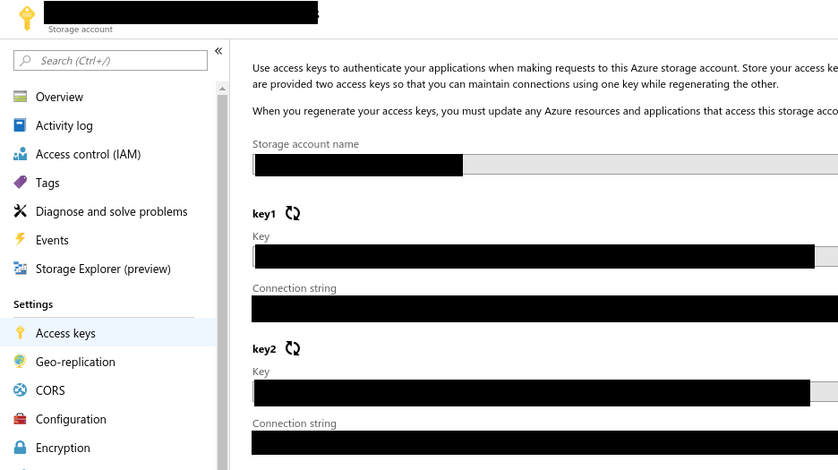

AzureBlob
=========

The *AzureBlob* package provides functionality for downloading and uploading content between Julia and [Azure Blob Storage](https://azure.microsoft.com/en-us/services/storage/blobs).

The interaction is through the REST interface provided by the blob storage.
Downloading files uses HTTP GET and uploading uses HTTP PUT through the [HTTP package](https://github.com/JuliaWeb/HTTP.jl).


## Authorization details

Authorization happens with the `SharedKey` scheme as described in [official docs](https://docs.microsoft.com/en-us/rest/api/storageservices/authorize-with-shared-key).
This uses a signature that needs the storage account and storage key of the blob storage.

The "Access keys" tab of the storage account look like this.



The storage account name is available in the top left corner and the storage key is one of the "Key" fields.

The screenshot is from early 2019.


## Usage

Aquire a storage key (`<storagekey>`) as explained above.
We also need the blob (`<blob>`) to download/upload to; the directory (`<directory>`); the container (`<container>`); and the storageaccount (`<storageaccount>`).

There is no concept of a folder hieraki in a blob storage, but if you click through a storage browser (e.g. in the Azure portal) the location of a blob is `<storageaccount> / <container> / <directory> / <blob>`.

For the example here we want to upload the very simple JSON document `{content}` to our specified blob:

```julia
julia> put_blob("{content}", "<blob>", "<directory>", "<container>", "<storageaccount>", "<storagekey>")

HTTP.Messages.Response:
"""
HTTP/1.1 201 Created
Transfer-Encoding: chunked
Content-MD5: KncWDXFIHB36Li0LJfj15g==
Last-Modified: Mon, 18 Feb 2019 22:18:05 GMT
ETag: "0x8D695EEF4751D8E"
Server: Windows-Azure-Blob/1.0 Microsoft-HTTPAPI/2.0
x-ms-request-id: 9a2ae5b7-d01e-0033-03d7-c789d6000000
x-ms-version: 2017-04-17
x-ms-request-server-encrypted: true
Date: Mon, 18 Feb 2019 22:18:05 GMT

"""
```

We can now download the very same blob:

```julia
julia> get_blob("<blob>", "<directory>", "<container>", "<storageaccount>", "<storagekey>")

HTTP.Messages.Response:
"""
HTTP/1.1 200 OK
Content-Length: 9
Content-Type: application/json
Content-MD5: KncWDXFIHB36Li0LJfj15g==
Last-Modified: Mon, 18 Feb 2019 22:18:05 GMT
Accept-Ranges: bytes
ETag: "0x8D695EEF4751D8E"
Server: Windows-Azure-Blob/1.0 Microsoft-HTTPAPI/2.0
x-ms-request-id: 9a2af6cf-d01e-0033-71d7-c789d6000000
x-ms-version: 2017-04-17
x-ms-lease-status: unlocked
x-ms-lease-state: available
x-ms-blob-type: BlockBlob
x-ms-server-encrypted: true
Date: Mon, 18 Feb 2019 22:18:14 GMT

{content}"""
```

Other types of storage are also possible, but I have not implemented those.


## Tests

The main functions of the *AzureBlob* package (`get_blob` and `put_blob`) are *not* tested in the unit tests since I do not have a publicly accessible blob storage.


## Acknowledgement

The *AzureBlob* package is inspired by similar functionality in the [AzureSMR package for R](https://github.com/Microsoft/AzureSMR) that is probably also available in the [cloudyr packages](https://github.com/cloudyr).

